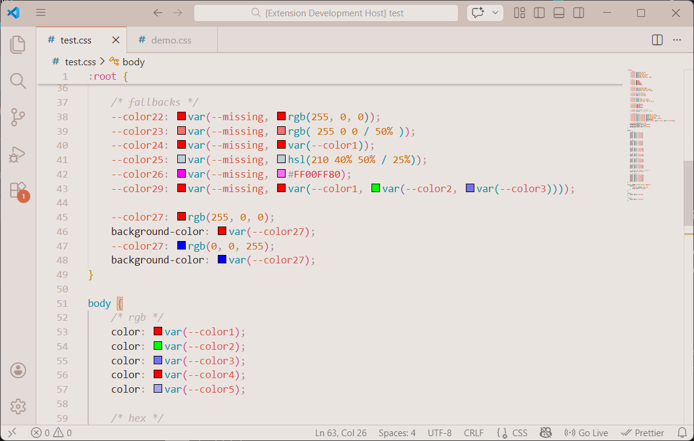

# Swatchify

    

    Color previews for CSS custom properties in Visual Studio Code.

    <a href="https://github.com/itsMatthewAllen/swatchify">GitHub</a> •
    <a href="https://www.linkedin.com/in/itsmatthewallen/">LinkedIn</a>

---

## What is Swatchify?
Swatchify is a lightweight VS Code extension that scans your stylesheets for
`var(--*)` expressions and renders a preview swatch next to every resolved
color.  Instead of guessing which value a variable holds, you can see it
instantly in the editor.

It works out‑of‑the‑box for **CSS** files and activates on the `css`, `scss`,
and `less` language modes (SCSS/LESS support is currently identical to CSS;
see Roadmap for enhancements).

## Features

- ✅ **Live color swatches** next to any `var(--…)` usage.
- 📦 **Fallback support** – sees inside nested `var()` and cascades correctly.
- 🔄 **Cascade‑aware** – respects specificity, scope, and media queries.
- 🔁 **Fast caching** for large stylesheets.
- 🧩 Works in **VS Code, SCSS and LESS** documents, with more language
  compatibility planned.

---

    

    Example editor view with swatches next to variable usages.

## Installation

1. Visit the [Swatchify marketplace page](https://marketplace.visualstudio.com/items?itemName=itsMatthewAllen.swatchify)
2. Click **Install** or run `ext install itsMatthewAllen.swatchify` from the
   command palette.
3. Reload the editor if prompted.

_(Alternatively, clone the repo and press `F5` in VS Code to run a dev
instance.)_

## Usage

Open any stylesheet containing CSS custom properties and `var()` uses.
Swatches should appear before all `var()` uses.  The extension does not
add any settings by default, but color previews can be disabled via
`editor.colorDecorators` or by uninstalling.

## Extension Settings

This extension does not currently expose any configuration options.  Future
releases may add controls for enabling/disabling specific languages or tuning
performance.

## Supported Languages

- CSS (fully supported)
- SCSS (falls back to CSS parsing; does *not* understand nested rules or
  variables that are SCSS‑specific)
- LESS (same as SCSS)

> **Note:** SCSS/LESS activation is included to catch users working in those
> modes, but the resolver treats files as plain CSS.  See the roadmap for a
> plan to implement deeper language‑specific parsing.

## Roadmap & Future Log

* **v0.2.0** – add real SCSS/LESS parser, respect nesting and mixins
* **v0.3.0** – workspace‑wide variable resolution across multiple files
* **v0.4.0** – performance optimizations, support for other languages
* **v1.0.0** – stable release, publish on Marketplace

Additional ideas:

* Command to show all definitions of a CSS variable
* Configuration panel for color format (RGB/HEX/HSL)

## Changelog

The project follows [Semantic Versioning](https://semver.org/).

### [0.1.0] – 2026‑02‑27
- Initial public release
- Core resolver, cascade/scoping, media‑query handling
- Jest test suite with 50+ tests
- Activation on CSS/SCSS/LESS modes

## Contributing

Contributions are welcome!  Please file issues or pull requests on
[GitHub](https://github.com/itsMatthewAllen/swatchify).  See the included
`test/` directory for examples of how the code is structured.

## License

MIT © Matthew Allen

---

*Swatchify* is maintained by [itsMatthewAllen](https://github.com/itsMatthewAllen).
Stay in touch:

- GitHub: https://github.com/itsMatthewAllen
- LinkedIn: https://www.linkedin.com/in/itsmatthewallen/

---

    

